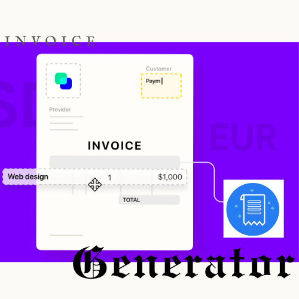
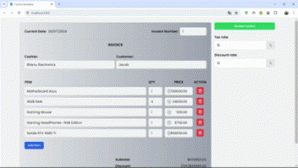

# Invoice Generator - ReactJs


AC
<p align="center">
  
</p>

Transform your invoicing process with our advanced React and TailwindCSS Invoice Generator. Effortlessly add items, set quantities, and input prices, tax rates, and discounts. Generate professional invoices and easily download them as PDFs or print them directly from your device. Utilize cutting-edge tools like [html-to-image](https://github.com/bubkoo/html-to-image) to capture your invoice data in high-quality images, and convert these images into downloadable PDFs using [jsPDF](https://github.com/parallax/jsPDF). Experience a streamlined and powerful invoicing solution that combines modern web technologies with practical functionality.


### Tools

- React
- Tailwind CSS
- Headless UI
- Html-to-image
- jsPDF

### Installation

```
npm install

npm start / npm run build
```

## What it looks like


<p align="center">
  
</p>
